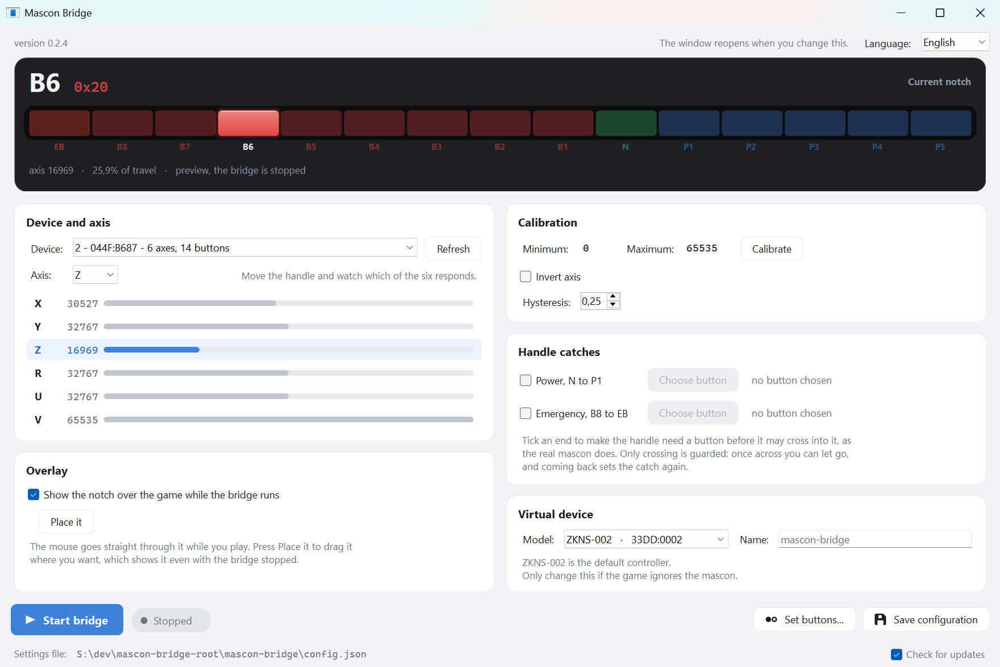
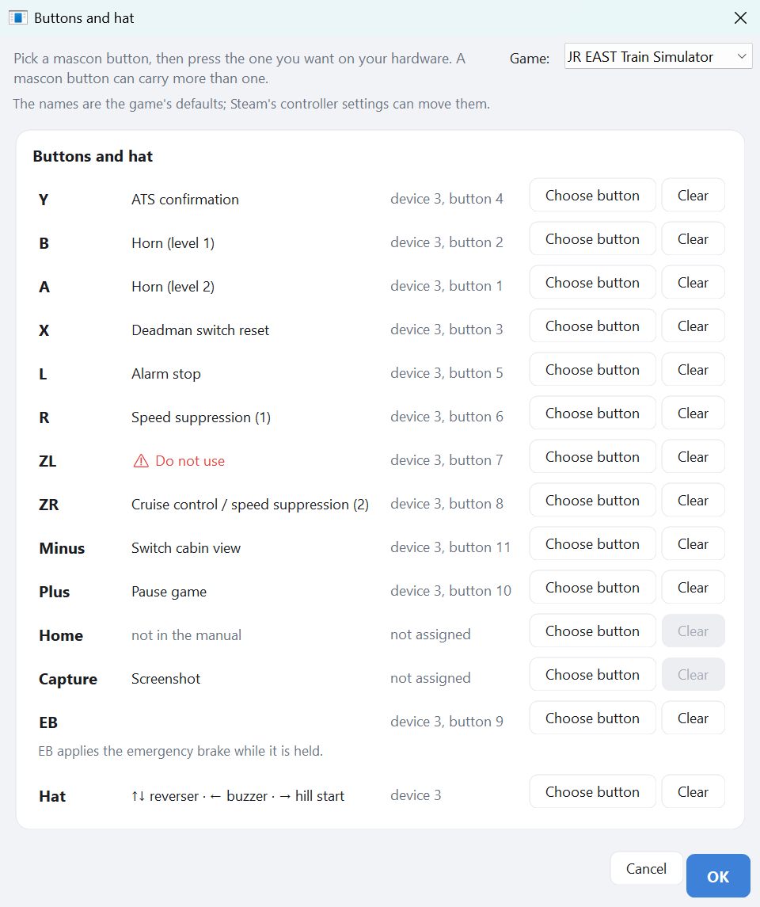

<p align="center">
  
</p>

<h1 align="center">mascon-bridge</h1>

<p align="center">
  <strong>Any analogue lever as a virtual ZUIKI mascon</strong>
</p>

<p align="center">
  <a href="https://github.com/alvaro-perez-mompean/mascon-bridge/actions/workflows/ci.yml"></a>
  <a href="https://github.com/alvaro-perez-mompean/mascon-bridge/releases/latest"></a>
  <a href="LICENSE"></a>
</p>

<p align="center">
  <a href="README.md">日本語</a> · <strong>English</strong>
</p>

Maps an analogue axis on any joystick, throttle or lever to a virtual **ZUIKI One
Handle MasCon**, so that JR EAST Train Simulator reads the **absolute position** of
your hardware instead of simulated keystrokes.

If Windows shows it in `joy.cpl` and it has an analogue axis, it will work: a HOTAS
throttle, a flight stick, a racing wheel, a slider box, a set of pedals, a homemade
controller. The bridge does not care what the device is — it reads one axis, splits
the travel into notches and publishes them as a mascon.

<p align="center">
  
</p>

<p align="center">
  
  <br>
  <sub>The notch overlay on top of the game. The mouse goes straight through it.</sub>
</p>

## How it works

The ZUIKI mascon is an ordinary HID joystick with one peculiarity: its handle is the
**Y axis**, and every notch reports **a fixed byte value**, with nothing in between:

| Notch | Value | Notch | Value | Notch | Value |
|---|---|---|---|---|---|
| EB | 0x00 | B4 | 0x3C | P1 | 0x9F |
| B8 | 0x05 | B3 | 0x49 | P2 | 0xB7 |
| B7 | 0x13 | B2 | 0x57 | P3 | 0xCE |
| B6 | 0x20 | B1 | 0x65 | P4 | 0xE6 |
| B5 | 0x2E | N  | 0x80 | P5 | 0xFF |

The bridge uses **HIDMaestro** to create a virtual HID device with the **same VID/PID
and descriptor** as the real mascon (94 bytes, included in the source), reads your
chosen axis and publishes the matching notch value. Windows, Steam and the game all
see a mascon. No keys, no counting presses, nothing to fall out of sync.

Buttons and a hat can be mapped too, from the same device or a different one — useful
when the lever and the buttons live on separate pieces of hardware.

## Install

Grab the latest zip from [Releases](https://github.com/alvaro-perez-mompean/mascon-bridge/releases),
unzip it and run **`mascon-bridge.exe`**.

That is the executable itself, sitting in the root of the zip. The `.cmd` file next
to it is a convenience for running from a source tree, where the executable is buried
several folders deep under `bin\`; from the zip there is nothing for it to do.

That really is everything. The .NET runtime is bundled, HIDMaestro is bundled, and
the bridge installs the HID driver itself the first time it starts — you only have to
accept the administrator prompt. There is nothing to download separately and no
certificate to set up by hand. That is what makes the zip around 90 MB.

Building from source is a separate path, described further down.

## Requirements

- Windows 10 or 11 **x64**
- Any joystick-class device with at least one analogue axis, visible in `joy.cpl`
- Administrator rights (the driver install, and every run)
- **.NET 10 SDK** to build from source — <https://dotnet.microsoft.com/download>.
  Not needed if you use a release zip.

No reboot, no Windows test signing mode and no kernel driver: HIDMaestro uses UMDF2,
which runs in user mode.

Developed and tested against a Thrustmaster T.16000M FCS HOTAS, using the TWCS
throttle lever for the handle and the stick for buttons and hat. Nothing in the code
is specific to it.

## Build from source

**Skip this whole section if you downloaded a release.** None of it is needed: the
zip already carries `HIDMaestro.Core.dll`, and the bridge installs the driver itself
on the first run.

`HIDMaestro.Core.dll` is a third party binary of about 40 MB and is not committed, so
a clone has to fetch it before it will build:

1. Download the latest HIDMaestro release from
   <https://github.com/hifihedgehog/HIDMaestro/releases>.
2. Copy `HIDMaestro.Core.dll` out of the zip into this project's `lib\` folder.
3. Build:

   ```
   cd mascon-bridge
   dotnet build -c Release
   ```

   The executable lands in
   `bin\Release\net10.0-windows10.0.26100.0\win-x64\mascon-bridge.exe`.

### Checking the driver on its own

Not a required step, but a quick way to tell a driver problem from a bridge problem:
run `HIDMaestroTest.exe emulate xbox-360-wired` once **as administrator**. It
generates the certificate, signs and installs the driver, exactly as the bridge does
at startup. If an Xbox pad appears in `joy.cpl`, the driver side is fine and anything
still broken is this project's fault. Type `quit` to exit.

## Use

Double click **`mascon-bridge.exe`** and accept the UAC prompt. It opens the control
panel:

- **Device** and **Axis** dropdowns. All six axes of the selected device are shown
  live, so you can move your lever and see which one responds — devices rarely report
  a useful name, so this is the reliable way to identify both.
- **Calibrate**: press it, move the lever end to end, press Finish. This is what makes
  the bridge hardware agnostic: it learns your actual travel rather than assuming a
  range.
- **Invert axis**, for levers whose travel runs the other way.
- **Handle catches**, optional, off by default. Both ends of the real handle are
  protected against being reached by accident: a thumb button guards N to P1, and a
  cam that has to be pushed past guards B8 to EB. An analogue lever cannot reproduce
  the cam's extra force, so each becomes a button you choose by pressing it. Only
  crossing is guarded: once across you can let go, and coming back sets the catch
  again. Braking is never held back by the power catch.
- The **overlay**, on by default: while the bridge runs, the fifteen notches are drawn
  as a vertical strip on top of the game, laid out like the lever itself — emergency at
  the top, full power at the bottom — with the notch named beside it. The mouse passes straight through it, so it can never eat a click meant for the
  game. **Place it** drags it where you want and shows it even with the bridge stopped.
  It only draws over a game running windowed or borderless — a game in exclusive
  fullscreen owns the display, and nothing short of hooking its renderer would appear
  over it.
- The **version**, top left. When a newer release has been published it turns into a
  link to the releases page. The check is one request to GitHub at startup, it
  downloads and installs nothing, and **Check for updates** at the bottom of the window
  switches it off.
- The **current notch** in large type, live. This works with the bridge stopped, as a
  preview, so calibration and inversion can be checked without creating any device.
- **Model**, which mascon to impersonate. Leave it alone unless the game ignores the
  bridge; see below.
- **Start bridge**, then launch Steam and the game, in that order — the game enumerates
  controllers at startup.
- **Language**, at the top of the window. See below.

In the game's Steam properties, **leave Steam Input enabled**. Unlike the official JR
East controller, the ZUIKI mascon needs it.

`config.json` is written on first run, in `%APPDATA%\mascon-bridge\`. It lives outside
the program's folder so that updating cannot lose it: a release unzips into a folder
named after its version, and settings kept beside the executable would be left behind
every time, calibration and bindings with them. An older install that has a
`config.json` next to the executable is copied across the first time, not abandoned.

The window shows the file it is using along the bottom. `--config <path>` uses a
different one, for keeping several setups or working in a source tree. Delete the file
to start over.

**Buttons and the hat** are set from the window: **Set buttons...** opens a page with
the mascon's twelve buttons, `EB` for the emergency brake, and the hat. Pick one, press
the button you want on your hardware, and it is bound. Nothing is bound out of the box —
guessing which button of yours is `A` would only fire something in the game with nothing
on screen to explain it.

The hat row is the exception: it takes a whole **device** rather than one button, since
the four directions come together. Push the hat itself, or press any button on the
device it is on.

The same mascon button can be reached from several physical buttons, on different
devices if you like: pressing another one adds it rather than replacing what is there.
**Clear** drops every button bound to that one. It is all still `config.json` underneath,
and editing it by hand keeps working.

The page can also say what each button does in the game. Pick **JR EAST Train Simulator**
under **Game** and every row takes the name its manual gives it, `ZL` included — which the
manual prints in red and tells you not to use. The names are the game's defaults and
Steam's controller settings can move them; **None** puts the page back to bare button names.

<p align="center">
  
</p>

### Language

The program speaks **Japanese by default**, and English if you pick it from the
selector at the top of the window. The choice is remembered in `config.json` as
`"Language": "ja"` or `"en"`, and the window reopens in the new language straight
away.

Everything is translated: the window, the dialogs and the console modes. Language
names are always written in their own language, so the list is readable whichever
one the program happens to be in.

### Console modes

The window covers everyday use. The console modes remain, for diagnosis:

```
mascon-bridge.exe list       live view of joysticks, axes and buttons
mascon-bridge.exe calibrate  measures the lever travel, writes it to config.json
mascon-bridge.exe test       cycles the notches on its own, without any joystick
mascon-bridge.exe run        normal mode, no window
```

## Tests

```
dotnet test mascon-bridge.slnx
```

126 tests over the parts that can be checked without hardware: the notch table and
report packing, the axis maths and hysteresis, configuration round trips and model
resolution, and the winmm helpers for hat and buttons. Device enumeration and the
HIDMaestro calls need real hardware and are left out.

The tests reference the main project, so `lib\HIDMaestro.Core.dll` has to be in place
before they will build — the same prerequisite as building the app. CI downloads that
DLL from the pinned HIDMaestro release, checks its SHA256 and caches it, so a clean
clone needs nothing extra.

## Choosing the model

The **Model** dropdown in the control panel picks which mascon to impersonate. It is
also `"Model"` in `config.json`.

| Model | VID | PID | |
|---|---|---|---|
| ZKNS-001 | 0x0F0D | 0x00C1 | Nintendo's vendor id |
| ZKNS-001b | 0x33DD | 0x0001 | |
| **ZKNS-002** | **0x33DD** | **0x0002** | **default** |
| ZKNS-011 | 0x33DD | 0x0003 | |
| ZKNS-012 | 0x33DD | 0x0004 | |
| ZKNS-013 | 0x33DD | 0x0005 | |

**`ZKNS-002` is the default and should just work.** Steam recognising the device is not
the same as the game accepting it: `ZKNS-001` shows up perfectly in *Steam → Settings →
Controller* and the game still ignores it. Its `0x0F0D` is Nintendo's vendor id,
inherited from the Switch pad; the `0x33DD` ids belong to ZUIKI.

If the game does not react, work through the other `33DD` models before suspecting
anything else. Close and reopen the game on each round — it enumerates controllers at
startup, so switching model while it runs proves nothing.

### The name beside it

The **Name** box is what the device calls itself. Leave it empty and it is
`mascon-bridge`. The game never reads it — Steam and the game both match on the vendor
and product ids, which is why the bridge does not borrow the real mascon's name.

It is there for third party software that does look at the name. A BVE Trainsim input
plugin, for instance, can map a device to a profile by name, in which case entering the
real mascon's name is what makes the profile match. It takes effect the next time the
bridge starts, and it is `"ProductString"` in `config.json`.

`try-model.ps1` automates that loop from a console:

```powershell
Set-ExecutionPolicy -Scope Process Bypass
.\try-model.ps1 ZKNS-011
```

## Troubleshooting

**The game reacts to both your physical device and the virtual mascon.**
Install [HidHide](https://github.com/nefarius/HidHide) and hide your controller from
applications, leaving only the virtual mascon visible.

**The lever jumps two notches at once, or flickers at an edge.**
Raise `Hysteresis` to 0.35. It is the fraction of a zone you must cross to change notch.
Cheap or worn potentiometers need more; a smooth lever can go lower.

**The notches are not spread evenly over the travel.**
Calibrate again. If P5 still arrives early, trim `AxisMin`/`AxisMax` by hand — useful
for levers with a dead zone or a spring detent at one end.

**Emergency brake releases the instant you apply it.**
A button bound to `EB` is momentary. EB is also the last position of the handle, which
is how the real mascon works, so put the lever there instead and it stays applied.

**Nothing is detected as a controller at all.**
Check that the bridge is started before Steam, and that Steam Input is enabled for the
game. Then try the other models.

**The axis moves in `joy.cpl` but the window shows nothing.**
Wrong device or wrong axis. Move your lever and watch which of the six rows changes.

**Anti-cheat.**
HIDMaestro does not hide that the device is virtual. Fine for this game, but do not use
the driver with competitive titles that ship kernel level anti-cheat.

## Layout

| File | What it is |
|---|---|
| `Zuiki.cs` | HID descriptor, notch table, report format |
| `Joystick.cs` | Joystick input through winmm, no dependencies |
| `VirtualMascon.cs` | HIDMaestro wrapper |
| `BridgeRunner.cs` | The bridge loop, zone splitting and hysteresis, shared by console and window |
| `MainForm.cs` | The control panel |
| `Theme.cs` | The palette, the type scale and the drawing helpers the window shares |
| `NotchDisplay.cs` | The notch scale: EB, B8 to B1, N, P1 to P5, lit one at a time |
| `Card.cs` / `AxisRow.cs` / `CatchRow.cs` / `FlatButton.cs` / `StatusPill.cs` | The hand painted controls the panel is built from |
| `OverlayWindow.cs` / `OverlayPlacement.cs` | The notch strip drawn over the game, and where it is put |
| `Config.cs` / `config.json` | Configuration, and where it lives |
| `UpdateCheck.cs` | Whether a newer release has been published |
| `Program.cs` | Entry point and console modes |
| `zuiki-zkns001.json` | The HIDMaestro profile as JSON, if you prefer loading it from disk |
| `mascon-bridge.cmd` | Convenience launcher for a source tree: elevates, then opens the executable from under `bin\`. Not needed with a release, where the executable is right there |
| `try-model.ps1` | Switches `"Model"` and relaunches, to work through the six models |
| `tests/` | xUnit suite over the hardware-independent logic |
| `release-notes/` | The changelog for each tag. The release workflow puts `release-notes/<tag>.md` into the published notes, and falls back to the commit subjects if there is no file for that tag |
| `Strings.*.resx` / `Strings.cs` | Every piece of text the program shows, and the typed accessor for it |
| `Language.cs` | Which languages ship, and applying one |
| `assets/` | `icon.svg` is the icon source; `build-icon.py` rasterises it into `mascon-bridge.ico`. `gen-strings.py` regenerates the resources and `Strings.cs` from one table |

## License

MIT. See [LICENSE](LICENSE).

The HIDMaestro binary this project links against is third party and carries its own
licence; it is downloaded rather than redistributed here.

## Sources

- Train Controller Database — ZKNS-001 entry and HID descriptor:
  <https://traincontrollerdb.marcriera.cat/hardware/zkns001/>
- `cracrayol/ConToJREts` — notch value table and button map:
  <https://github.com/cracrayol/ConToJREts>
- HIDMaestro: <https://github.com/hifihedgehog/HIDMaestro>

## Trademarks and disclaimer

This is an unofficial tool written by an individual. It is not affiliated with,
endorsed by, sponsored by or supported by ZUIKI Inc., East Japan Railway Company or
Nintendo Co., Ltd.

ZUIKI, One Handle MasCon, JR EAST Train Simulator and Nintendo Switch are trademarks
of their respective owners, referred to here only to identify the hardware and
software this tool works with.

The virtual device reports the same vendor and product ids as the real mascon. That
is what makes the game recognise it as a supported controller, and it is the only
reason those values are used.
