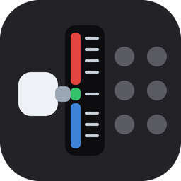

<p align="center">
  
</p>

<h1 align="center">mascon-bridge</h1>

<p align="center">
  <strong>Any analogue lever as a virtual ZUIKI mascon</strong>
</p>

<p align="center">
  <a href="https://github.com/alvaro-perez-mompean/mascon-bridge/actions/workflows/ci.yml"></a>
  <a href="https://github.com/alvaro-perez-mompean/mascon-bridge/releases/latest"></a>
  <a href="LICENSE"></a>
</p>

Maps an analogue axis on any joystick, throttle or lever to a virtual **ZUIKI One
Handle MasCon**, so that JR EAST Train Simulator reads the **absolute position** of
your hardware instead of simulated keystrokes.

If Windows shows it in `joy.cpl` and it has an analogue axis, it will work: a HOTAS
throttle, a flight stick, a racing wheel, a slider box, a set of pedals, a homemade
controller. The bridge does not care what the device is — it reads one axis, splits
the travel into notches and publishes them as a mascon.

## How it works

The ZUIKI mascon is an ordinary HID joystick with one peculiarity: its handle is the
**Y axis**, and every notch reports **a fixed byte value**, with nothing in between:

| Notch | Value | Notch | Value | Notch | Value |
|---|---|---|---|---|---|
| EB | 0x00 | B4 | 0x3C | P1 | 0x9F |
| B8 | 0x05 | B3 | 0x49 | P2 | 0xB7 |
| B7 | 0x13 | B2 | 0x57 | P3 | 0xCE |
| B6 | 0x20 | B1 | 0x65 | P4 | 0xE6 |
| B5 | 0x2E | N  | 0x80 | P5 | 0xFF |

The bridge uses **HIDMaestro** to create a virtual HID device with the **same VID/PID
and descriptor** as the real mascon (94 bytes, included in the source), reads your
chosen axis and publishes the matching notch value. Windows, Steam and the game all
see a mascon. No keys, no counting presses, nothing to fall out of sync.

Buttons and a hat can be mapped too, from the same device or a different one — useful
when the lever and the buttons live on separate pieces of hardware.

## Download

Grab the latest zip from [Releases](https://github.com/alvaro-perez-mompean/mascon-bridge/releases),
unzip it and run **`mascon-bridge.cmd`**.

Nothing else to install: the .NET runtime is bundled and so is HIDMaestro, which
installs its own driver the first time the bridge starts. That is what makes the
download around 90 MB.

To build from source instead, see below.

## Requirements

- Windows 10 or 11 **x64**
- Any joystick-class device with at least one analogue axis, visible in `joy.cpl`
- Administrator rights (the driver install, and every run)
- **.NET 10 SDK** to build from source — <https://dotnet.microsoft.com/download>.
  Not needed if you use a release zip.

No reboot, no Windows test signing mode and no kernel driver: HIDMaestro uses UMDF2,
which runs in user mode.

Developed and tested against a Thrustmaster T.16000M FCS HOTAS, using the TWCS
throttle lever for the handle and the stick for buttons and hat. Nothing in the code
is specific to it.

## Install

1. Download the latest HIDMaestro release from
   <https://github.com/hifihedgehog/HIDMaestro/releases>.
2. Run `HIDMaestroTest.exe emulate xbox-360-wired` once **as administrator**. That
   generates the certificate, signs and installs the driver. If an Xbox pad shows up
   in `joy.cpl`, everything else will work. Type `quit` to exit.
3. Copy `HIDMaestro.Core.dll` into this project's `lib\` folder.
4. Build:

   ```
   cd mascon-bridge
   dotnet build -c Release
   ```

   The executable lands in
   `bin\Release\net10.0-windows10.0.26100.0\win-x64\mascon-bridge.exe`.

## Use

Double click **`mascon-bridge.cmd`** and accept the UAC prompt. It opens the control
panel:

- **Device** and **Axis** dropdowns. All six axes of the selected device are shown
  live, so you can move your lever and see which one responds — devices rarely report
  a useful name, so this is the reliable way to identify both.
- **Calibrate**: press it, move the lever end to end, press Finish. This is what makes
  the bridge hardware agnostic: it learns your actual travel rather than assuming a
  range.
- **Invert axis**, for levers whose travel runs the other way.
- **EB on the handle** chooses between 15 notches (EB at the end of the travel, like
  the real mascon) and 14 (B8 to P5, leaving EB to a button). Pick 15 if you need the
  emergency brake to stay applied while you do something else.
- The **current notch** in large type, live. This works with the bridge stopped, as a
  preview, so calibration and inversion can be checked without creating any device.
- **Start bridge**, then launch Steam and the game, in that order — the game enumerates
  controllers at startup.

In the game's Steam properties, **leave Steam Input enabled**. Unlike the official JR
East controller, the ZUIKI mascon needs it.

`config.json` is written on first run and is not part of the repository — it holds the
device numbers and calibration of one particular machine. Delete it to start over.

Buttons and the hat are configured in `config.json`. Each entry names a physical device
and button number and the mascon button it maps to (`Y`, `B`, `A`, `X`, `L`, `R`, `ZL`,
`ZR`, `Minus`, `Plus`, `Home`, `Capture`, or `EB` for the emergency brake). Several
physical buttons may map to the same mascon button.

### Console modes

The window covers everyday use. The console modes remain, for diagnosis:

```
mascon-bridge.exe list       live view of joysticks, axes and buttons
mascon-bridge.exe calibrate  measures the lever travel, writes it to config.json
mascon-bridge.exe test       cycles the notches on its own, without any joystick
mascon-bridge.exe run        normal mode, no window
```

## Tests

```
dotnet test mascon-bridge.slnx
```

107 tests over the parts that can be checked without hardware: the notch table and
report packing, the axis maths and hysteresis, configuration round trips and model
resolution, and the winmm helpers for hat and buttons. Device enumeration and the
HIDMaestro calls need real hardware and are left out.

The tests reference the main project, so `lib\HIDMaestro.Core.dll` has to be in place
before they will build — the same prerequisite as building the app. CI downloads that
DLL from the pinned HIDMaestro release, checks its SHA256 and caches it, so a clean
clone needs nothing extra.

## Choosing the model

`config.json` → `"Model"` picks which device to emulate:

| Model | VID | PID |
|---|---|---|
| ZKNS-001 | 0x0F0D | 0x00C1 |
| ZKNS-001b | 0x33DD | 0x0001 |
| ZKNS-002 | 0x33DD | 0x0002 |
| ZKNS-011 | 0x33DD | 0x0003 |
| ZKNS-012 | 0x33DD | 0x0004 |
| ZKNS-013 | 0x33DD | 0x0005 |

**Start with `ZKNS-002`.** Steam recognising the device is not the same as the game
accepting it: `ZKNS-001` shows up perfectly in *Steam → Settings → Controller* and the
game still ignores it. Its `0x0F0D` is Nintendo's vendor id, inherited from the Switch
pad; the `0x33DD` ids belong to ZUIKI. If the game does not react, work through the
`33DD` models before suspecting anything else — it is a one line change.

`try-model.ps1` automates that loop:

```powershell
Set-ExecutionPolicy -Scope Process Bypass
.\try-model.ps1 ZKNS-002
```

Close and reopen the game on each round.

## Troubleshooting

**The game reacts to both your physical device and the virtual mascon.**
Install [HidHide](https://github.com/nefarius/HidHide) and hide your controller from
applications, leaving only the virtual mascon visible.

**The lever jumps two notches at once, or flickers at an edge.**
Raise `Hysteresis` to 0.35. It is the fraction of a zone you must cross to change notch.
Cheap or worn potentiometers need more; a smooth lever can go lower.

**The notches are not spread evenly over the travel.**
Calibrate again. If P5 still arrives early, trim `AxisMin`/`AxisMax` by hand — useful
for levers with a dead zone or a spring detent at one end.

**Emergency brake releases the instant you apply it.**
The EB button is momentary. Tick **EB on the handle** so EB becomes a lever position
instead, which is how the real mascon works.

**Nothing is detected as a controller at all.**
Check that the bridge is started before Steam, and that Steam Input is enabled for the
game. Then try the other models.

**The axis moves in `joy.cpl` but the window shows nothing.**
Wrong device or wrong axis. Move your lever and watch which of the six rows changes.

**Anti-cheat.**
HIDMaestro does not hide that the device is virtual. Fine for this game, but do not use
the driver with competitive titles that ship kernel level anti-cheat.

## Layout

| File | What it is |
|---|---|
| `Zuiki.cs` | HID descriptor, notch table, report format |
| `Joystick.cs` | Joystick input through winmm, no dependencies |
| `VirtualMascon.cs` | HIDMaestro wrapper |
| `BridgeRunner.cs` | The bridge loop, zone splitting and hysteresis, shared by console and window |
| `MainForm.cs` | The control panel |
| `Config.cs` / `config.json` | Configuration |
| `Program.cs` | Entry point and console modes |
| `zuiki-zkns001.json` | The HIDMaestro profile as JSON, if you prefer loading it from disk |
| `mascon-bridge.cmd` | Elevates and opens the control panel |
| `try-model.ps1` | Switches `"Model"` and relaunches, to work through the six models |
| `tests/` | xUnit suite over the hardware-independent logic |
| `assets/` | `icon.svg` is the icon source; `build-icon.py` rasterises it into `mascon-bridge.ico` |

## License

MIT. See [LICENSE](LICENSE).

The HIDMaestro binary this project links against is third party and carries its own
licence; it is downloaded rather than redistributed here.

## Sources

- Train Controller Database — ZKNS-001 entry and HID descriptor:
  <https://traincontrollerdb.marcriera.cat/hardware/zkns001/>
- `cracrayol/ConToJREts` — notch value table and button map:
  <https://github.com/cracrayol/ConToJREts>
- HIDMaestro: <https://github.com/hifihedgehog/HIDMaestro>
