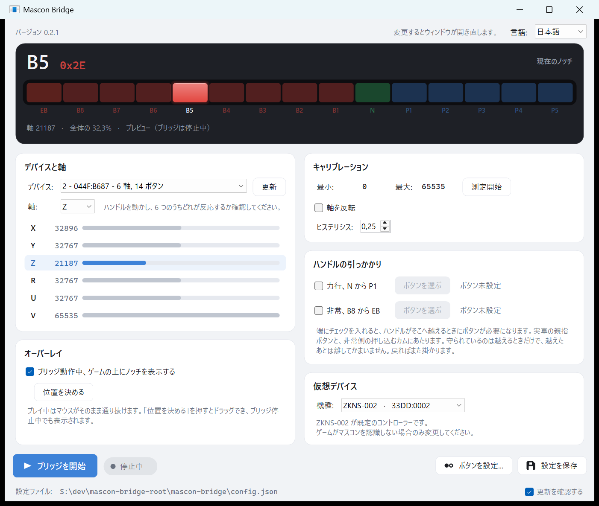
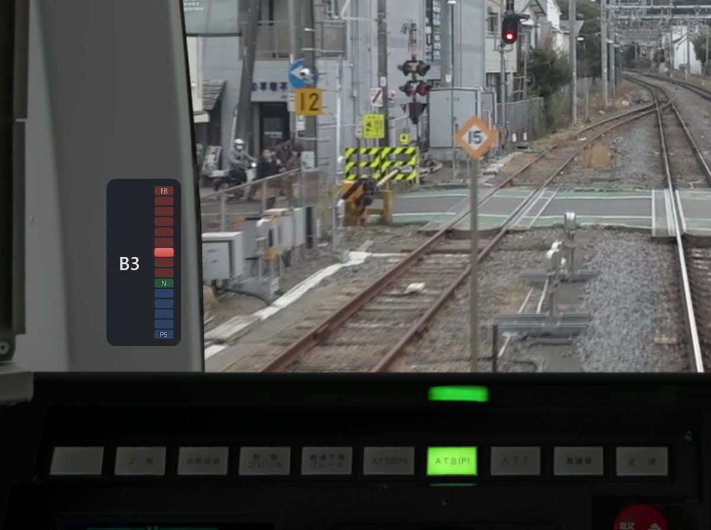

<p align="center">
  
</p>

<h1 align="center">mascon-bridge</h1>

<p align="center">
  <strong>任意のアナログレバーを ZUIKI マスコンとして使う</strong>
</p>

<p align="center">
  <a href="https://github.com/alvaro-perez-mompean/mascon-bridge/actions/workflows/ci.yml"></a>
  <a href="https://github.com/alvaro-perez-mompean/mascon-bridge/releases/latest"></a>
  <a href="LICENSE"></a>
</p>

<p align="center">
  <strong>日本語</strong> · <a href="README.en.md">English</a>
</p>

ジョイスティック、スロットル、レバーのアナログ軸を仮想の **ZUIKI ワンハンドルマスコン**
に変換します。これにより JR EAST Train Simulator が、キー入力の再現ではなく
ハンドルの**絶対位置**を読み取るようになります。

`joy.cpl` に表示され、アナログ軸を 1 本でも持つ機器であれば動作します。HOTAS の
スロットル、フライトスティック、レーシングホイール、スライダーボックス、ペダル、
自作コントローラーなど、機器の種類は問いません。軸を 1 本読み取り、その可動域を
ノッチに分割してマスコンとして出力するだけだからです。

<p align="center">
  
</p>

<p align="center">
  
  <br>
  <sub>ノッチをゲームの上に表示するオーバーレイ。マウスはそのまま通り抜けます。</sub>
</p>

## 仕組み

ZUIKI のマスコンは、ひとつの特徴を除けば普通の HID ジョイスティックです。ハンドルが
**Y 軸**に割り当てられ、各ノッチが**固定のバイト値**を返し、その中間の値は存在しません。

| ノッチ | 値 | ノッチ | 値 | ノッチ | 値 |
|---|---|---|---|---|---|
| EB | 0x00 | B4 | 0x3C | P1 | 0x9F |
| B8 | 0x05 | B3 | 0x49 | P2 | 0xB7 |
| B7 | 0x13 | B2 | 0x57 | P3 | 0xCE |
| B6 | 0x20 | B1 | 0x65 | P4 | 0xE6 |
| B5 | 0x2E | N  | 0x80 | P5 | 0xFF |

本ソフトは **HIDMaestro** を使い、実機と**同一の VID/PID と HID ディスクリプタ**
（94 バイト、ソースに同梱）を持つ仮想 HID デバイスを作成します。選択した軸を読み取り、
対応するノッチ値を出力するため、Windows も Steam もゲームもマスコンとして認識します。
キー入力も、押した回数の管理も、ずれの心配もありません。

ボタンとハットも割り当てられます。レバーとは別の機器からでも指定できるため、
ハンドルとボタンが別々のハードウェアにある構成でも使えます。

## インストール

[Releases](https://github.com/alvaro-perez-mompean/mascon-bridge/releases) から最新の
zip をダウンロードし、展開して **`mascon-bridge.exe`** を実行してください。

これだけです。.NET ランタイムも HIDMaestro も同梱されており、HID ドライバーは初回起動時に
本ソフトが自動でインストールします。必要なのは管理者権限の確認だけで、別途ダウンロードする
ものも、手動で用意する証明書もありません。zip が約 90 MB あるのはそのためです。

ソースからのビルドは別の手順です。後述します。

## 動作環境

- Windows 10 または 11 の **x64**
- `joy.cpl` に表示され、アナログ軸を 1 本以上持つジョイスティック類
- 管理者権限（ドライバーのインストール時と、毎回の起動時）
- ソースからビルドする場合は **.NET 10 SDK** — <https://dotnet.microsoft.com/download>
  リリース版の zip を使う場合は不要です。

再起動も、Windows のテスト署名モードも、カーネルドライバーも不要です。HIDMaestro は
ユーザーモードで動作する UMDF2 を使用します。

動作確認は Thrustmaster T.16000M FCS HOTAS で行いました。TWCS スロットルのレバーを
ハンドルに、スティックをボタンとハットに割り当てています。ただし、この機種に依存した
コードは一切ありません。

## 使い方

**`mascon-bridge.exe`** を実行し、UAC の確認を承認すると設定ウィンドウが開きます。

- **デバイス**と**軸**の選択。選んだデバイスの 6 軸すべてがリアルタイムで表示されるので、
  レバーを動かしてどれが反応するか見れば分かります。機器名はあてにならないため、
  これが確実な方法です。
- **測定開始**：押してレバーを端から端まで動かし、測定終了を押します。可動域を実測する
  ため、機種を問わず動作します。
- **軸を反転**：可動方向が逆のレバー向け。
- **ハンドルの引っかかり**：任意、既定では無効です。実車のハンドルは両端が誤操作から
  守られています。力行側（N から P1）は親指のボタン、非常側（B8 から EB）は押し込む
  必要のあるカムです。アナログのレバーではカムの重さを再現できないため、どちらも
  ボタンに置き換えます。ボタンは押して選びます。守られているのは越えるときだけで、
  越えたあとは離してかまいません。戻ればまた掛かります。ブレーキ側が力行の
  引っかかりに妨げられることはありません。
- **オーバーレイ**：既定で有効です。ブリッジ動作中、15 のノッチを縦のストリップとして
  ゲームの上に表示します。並びは実際のハンドルと同じで、上が非常ブレーキ、下が P5、
  横にノッチ名が出ます。マウスはそのまま通り抜ける
  ため、ゲームへのクリックを奪うことはありません。**位置を決める**を押すとドラッグでき、
  ブリッジ停止中でも表示されます。表示できるのはゲームがウィンドウまたはボーダーレスで
  動いている場合だけです。排他的フルスクリーンでは画面をゲームが占有するため、
  描画に割り込まない限り上に出せません。
- **バージョン**：左上に表示します。新しいリリースが公開されているとリンクに変わり、
  リリースページを開きます。確認は起動時に GitHub へ 1 回問い合わせるだけで、
  ダウンロードもインストールもしません。ウィンドウ下部の**更新を確認する**で切れます。
- **現在のノッチ**を大きく表示します。ブリッジ停止中もプレビューとして動作するため、
  仮想デバイスを作らずにキャリブレーションと反転を確認できます。
- **機種**：どのマスコンとして振る舞うか。ゲームが認識しない場合以外は変更不要です。後述します。
- **言語**：ウィンドウ上部にあります。後述します。
- **ブリッジを開始**したあと、Steam、ゲームの順に起動してください。ゲームは起動時に
  コントローラーを列挙します。

Steam のゲームのプロパティでは、**Steam Input を有効のままにしてください**。JR East の
公式コントローラーとは逆で、ZUIKI マスコンには必要です。

`config.json` は初回起動時に `%APPDATA%\mascon-bridge\` に作成されます。プログラムの
フォルダーの外に置くのは、更新で失わないためです。リリースはバージョン名のフォルダーに
展開されるので、実行ファイルの隣に設定を置くと更新のたびに取り残され、キャリブレーションも
割り当ても消えてしまいます。以前の版で実行ファイルの隣に `config.json` がある場合は、
初回にそちらへ引き継ぎます。

使用中のファイルはウィンドウ下部に表示されます。`--config <パス>` で別のファイルを
指定できます。最初からやり直したい場合は削除してください。

**ボタンとハット**はウィンドウから設定します。**ボタンを設定...** を押すと、マスコンの
12 個のボタン、非常ブレーキの `EB`、そしてハットが並んだ画面が開きます。割り当て先を選び、
手元の機器で使いたいボタンを押すだけです。初期状態では何も割り当てられていません。どのボタンが
`A` なのかを勝手に決めても、ゲーム側で何かが動くだけで、画面には理由が出ないからです。

同じマスコンのボタンに複数の物理ボタンを割り当てられます。別々の機器にまたがっても構いません。
もう 1 つ押すと、置き換えではなく追加されます。**消す** はそのボタンに割り当てられたものを
すべて外します。保存先は従来どおり `config.json` なので、手で編集する方法も使えます。

### 言語

本ソフトは**既定で日本語**です。ウィンドウ上部の選択欄から English に切り替えられます。
選択内容は `config.json` に `"Language": "ja"` または `"en"` として保存され、
ウィンドウはすぐに新しい言語で開き直します。

ウィンドウ、ダイアログ、コンソールモードまですべて翻訳されています。言語名は常に
その言語自身で表記されるため、読めない言語で開いてしまっても自分の言語を見つけられます。

### コンソールモード

通常の操作はウィンドウで完結します。コンソールモードは診断用に残しています。

```
mascon-bridge.exe list       ジョイスティック、軸、ボタンをリアルタイム表示
mascon-bridge.exe calibrate  レバーの可動域を測定し config.json に保存
mascon-bridge.exe test       ジョイスティックなしでノッチを順に送る
mascon-bridge.exe run        通常動作、ウィンドウなし
```

## 機種の選択

ウィンドウの**機種**の選択欄で、どのマスコンとして振る舞うかを指定します。`config.json` の
`"Model"` と同じ項目です。

| 機種 | VID | PID | |
|---|---|---|---|
| ZKNS-001 | 0x0F0D | 0x00C1 | 任天堂のベンダー ID |
| ZKNS-001b | 0x33DD | 0x0001 | |
| **ZKNS-002** | **0x33DD** | **0x0002** | **既定** |
| ZKNS-011 | 0x33DD | 0x0003 | |
| ZKNS-012 | 0x33DD | 0x0004 | |
| ZKNS-013 | 0x33DD | 0x0005 | |

**既定の `ZKNS-002` でそのまま動くはずです。** Steam が認識することと、ゲームが受け付ける
ことは別です。`ZKNS-001` は *Steam → 設定 → コントローラ* に問題なく表示されますが、
ゲームは無視します。`0x0F0D` は Switch のコントローラーから受け継いだ任天堂のベンダー ID で、
`0x33DD` が ZUIKI のものだからです。

ゲームが反応しない場合は、他を疑う前にまず `33DD` の機種を順に試してください。毎回ゲームを
終了して起動し直す必要があります。起動時にコントローラーを列挙するため、起動したまま機種を
変えても意味がありません。

コンソールから試す場合は `try-model.ps1` が自動化します。

```powershell
Set-ExecutionPolicy -Scope Process Bypass
.\try-model.ps1 ZKNS-011
```

## うまくいかないとき

**ゲームが HOTAS と仮想マスコンの両方に反応する。**
[HidHide](https://github.com/nefarius/HidHide) をインストールし、使用中のコントローラーを
アプリケーションから隠して、仮想マスコンだけが見えるようにしてください。

**ノッチが 2 つ飛ぶ、または境目でちらつく。**
`Hysteresis` を 0.35 に上げてください。ノッチを切り替えるために越える必要がある、
1 ゾーンに対する割合です。安価なものや摩耗した可変抵抗ほど大きな値が必要になります。

**ノッチが可動域に均等に配置されない。**
もう一度キャリブレーションしてください。それでも P5 に早く到達する場合は、`AxisMin` と
`AxisMax` を手動で詰めてください。片側に遊びやばねの節度がある機器で有効です。

**非常ブレーキをかけた瞬間に解除される。**
`EB` に割り当てたボタンは押している間だけ有効です。EB は実機と同じくハンドルの
最終位置でもあるので、レバーをそこまで倒せばかかったままになります。

**コントローラーとしてまったく認識されない。**
Steam より先にブリッジを起動しているか、ゲームで Steam Input が有効かを確認し、
そのうえで他の機種を試してください。

**`joy.cpl` では軸が動くのに、ウィンドウには何も出ない。**
デバイスか軸の選択が違います。レバーを動かし、6 行のうちどれが変化するか確認してください。

**アンチチート。**
HIDMaestro は仮想デバイスであることを隠しません。本ソフトの用途では問題ありませんが、
カーネルレベルのアンチチートを備えた対戦ゲームでは使用しないでください。

## ソースからのビルド

**リリース版をダウンロードした場合、この節は不要です。** zip には
`HIDMaestro.Core.dll` が同梱されており、ドライバーも初回起動時に自動で入ります。

`HIDMaestro.Core.dll` は約 40 MB のサードパーティ製バイナリでリポジトリには含まれないため、
クローンからビルドするには先に取得する必要があります。

1. [HIDMaestro のリリース](https://github.com/hifihedgehog/HIDMaestro/releases)から
   最新版をダウンロードします。
2. zip から `HIDMaestro.Core.dll` を取り出し、本プロジェクトの `lib\` に置きます。
3. ビルドします。

   ```
   cd mascon-bridge
   dotnet build -c Release
   ```

   実行ファイルは
   `bin\Release\net10.0-windows10.0.26100.0\win-x64\mascon-bridge.exe` に生成されます。

テストの実行:

```
dotnet test mascon-bridge.slnx
```

ハードウェアなしで確認できる範囲を対象としています。ノッチ表とレポートの組み立て、
軸の計算とヒステリシス、設定の保存と読み込み、機種の解決、ハットとボタンの winmm 補助関数です。
デバイスの列挙と HIDMaestro の呼び出しは実機が必要なため対象外です。

各ファイルの役割や、より詳しい背景は[英語版 README](README.en.md) を参照してください。

## ライセンス

MIT。[LICENSE](LICENSE) を参照してください。

本ソフトがリンクする HIDMaestro のバイナリはサードパーティ製で、独自のライセンスに従います。
再配布ではなくダウンロードして取得しています。

## 出典

- Train Controller Database — ZKNS-001 の情報と HID ディスクリプタ:
  <https://traincontrollerdb.marcriera.cat/hardware/zkns001/>
- `cracrayol/ConToJREts` — ノッチ値の表とボタン割り当て:
  <https://github.com/cracrayol/ConToJREts>
- HIDMaestro: <https://github.com/hifihedgehog/HIDMaestro>

## 商標と免責

本ソフトは個人が制作した非公式のツールです。株式会社瑞起（ZUIKI）、東日本旅客鉄道株式会社、
任天堂株式会社とは一切関係がなく、これらの企業から承認、提供、支援を受けたものでもありません。

ZUIKI、One Handle MasCon、JR EAST Train Simulator、Nintendo Switch は、それぞれの権利者の
商標です。本ソフトでは、対応する機器やソフトを指し示す目的でのみ言及しています。

仮想デバイスが名乗るベンダー ID とプロダクト ID には実機と同じ値を使用しています。ゲームが
対応機器として認識するために必要だからで、それ以外の目的はありません。
